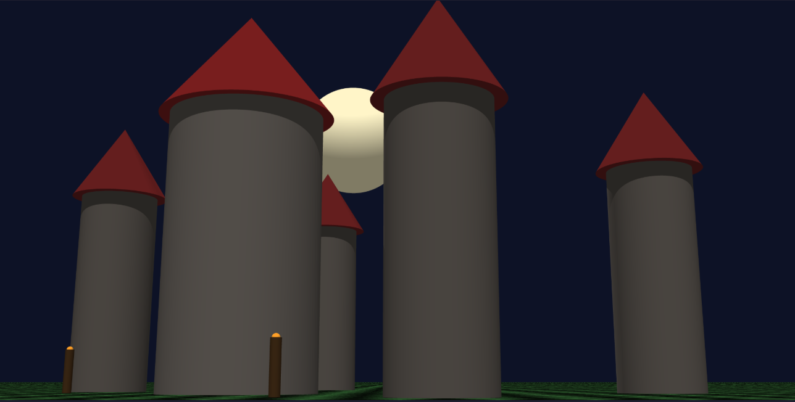

# Raytracer

A multithreaded CPU ray tracer written in modern C++, rendering 3D scenes described
in a simple JSON configuration format. It supports primitive geometry, multiple light
types, hard shadows, geometric transformations, and real-time preview through SFML.



---

## Features

- **Primitives** — spheres, planes, cylinders, and cones, each with per-object color
  and an optional checkerboard pattern on planes.
- **Lighting** — ambient, directional, and point lights, with configurable diffuse
  contribution and per-light color and intensity.
- **Shadows** — drop shadows cast by occluding geometry.
- **Transformations** — translation and rotation of scene objects.
- **Performance** — the frame buffer is rendered in parallel across multiple threads.
- **Preview** — the rendered image is displayed live in an SFML window, and can also be
  exported to PNG without a display via the included script.

## Architecture

The renderer is built around small, single-responsibility components and two factories
that decouple the scene description from the concrete geometry and light classes:

```
include/ , src/
├── main.cpp              entry point, SFML display
├── Renderer             ray/scene evaluation, multithreaded buffer fill
├── Camera / Ray         ray generation from the camera
├── Scene / SceneLoader  runtime scene assembled from parsed data
├── SceneBuilder
├── primitives/          Sphere, Plane, Cylinder, Cone (implement IPrimitive)
├── PrimitiveFactory     builds primitives from parsed config
├── lights/              Ambient, Directional, Point (implement ILight)
├── LightFactory         builds lights from parsed config
├── Math / Color / HitRecord / RenderSettings
└── parser/              JSON scene parser
    ├── SceneParser      top-level orchestration
    ├── CameraParser
    ├── PrimitivesParser
    ├── LightsParser
    └── JsonHelper
```

Parsing is separated from scene construction: `SceneParser` validates the file and
produces a `ParsedScene`, then `SceneLoader` turns that into a live `Scene` via the
factories. Parse errors report a message with the offending key, line, and column.

## Build

Requires a C++ compiler and [SFML](https://www.sfml-dev.org/) for the live preview.

```bash
make          # builds ./raytracer
make re       # full rebuild
make fclean   # remove build artifacts and binary
```

## Usage

```bash
./raytracer <scene_file>
./raytracer scenes/showcase.cfg
./raytracer --help
```

### Headless render to PNG

When you don't want (or can't use) the SFML window, `render.sh` runs the tracer and
converts its output to a PNG under `screenshots/`. It uses whichever of `magick`,
`convert`, or `ffmpeg` is available:

```bash
./render.sh scenes/showcase.cfg
# -> screenshots/showcase.png
```

## Scene format

Scenes are JSON files (see the `scenes/` directory for ready-made examples). A scene
defines a camera, a set of primitives, and a set of lights:

```json
{
    "camera": {
        "resolution": { "width": 1920, "height": 1080 },
        "position":  { "x": 0, "y": 3.5, "z": 13 },
        "direction": { "x": 0, "y": -0.22, "z": -1 },
        "fieldOfView": 62.0
    },
    "primitives": {
        "spheres":   [ { "x": 0, "y": 0.2, "z": -4, "r": 1.8, "color": { "r": 200, "g": 225, "b": 255 } } ],
        "cylinders": [ { "x": -7.5, "y": 0.5, "z": -9, "r": 0.7, "h": 7.0, "color": { "r": 65, "g": 60, "b": 55 } } ],
        "cones":     [ { "x": 1.5, "y": -2, "z": -7, "r": 0.55, "h": 2.5, "color": { "r": 245, "g": 175, "b": 0 } } ],
        "planes":    [ { "axis": "Y", "position": -2, "color": { "r": 175, "g": 175, "b": 175 }, "checkerboard": true } ]
    },
    "lights": {
        "ambient": 0.06,
        "diffuse": 1.0,
        "directional": [ { "x": -1, "y": -1.5, "z": -0.5, "intensity": 0.55, "color": { "r": 255, "g": 250, "b": 235 } } ],
        "point":       [ { "x": -5.5, "y": 1.5, "z": -1.5, "intensity": 1.0, "color": { "r": 255, "g": 80, "b": 20 } } ]
    }
}
```

The `scenes/` directory includes single-primitive tests (`sphere_only.cfg`,
`cone_only.cfg`, …), transformation demos (`rotation_demo.cfg`, `translation_demo.cfg`),
a `shadow_demo.cfg`, and full composed scenes (`showcase.cfg`, `castle.cfg`, `alot.cfg`).

## Project context

Built as part of the EPITECH curriculum (second year). The design emphasizes extensibility
through interfaces (`IPrimitive`, `ILight`) and factory-based construction, so new geometry
or light types can be added without touching the renderer or the parser.
